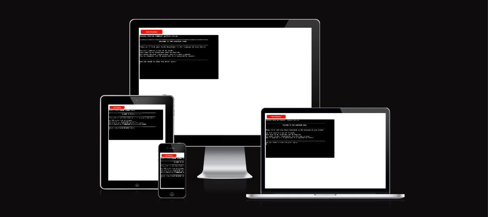

THE LANGUAGE GAME
---

Welcome,

The language game is a pyhton terminal game, which runs in the Code Institute mock terminal on Heroku.

The purpose of this game is learning while playing, the user will chose the language they want to play with
and they will have to translate to english (EN) some random words they will be given.

The game consist in 10 questions and every correct answer the user will earn a point.

Try to complete all 10 questions! 

[Link to The Language Game](https://the-language-game-4bf6dd38ccc8.herokuapp.com/)
---

---

## How to play

- The user enter to the game and they are give the set of instructions 
- Its given a choice to start game (y) 
- The player need to decide in which language you want to try their knowledge:
  - 1. Spanish
  - 2. French
  - 3. Italian
  - 4. German
- This answer needs to be numeric ex: Spanish is number 1.
- After, the player will need to answer 10 questions translating the word that is "shown" into english
- Finally th player will be able to check their scores and will be able to restart the challenge.

- The point of this game is to enjoy, learn and check your basic knowledge in different languages, the words 
provided are easy and usefull words to know and understand.

## Feauters

## Data Model

## Testing

## Bugs

## Deployment

## Credits