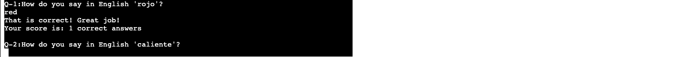
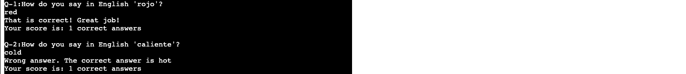
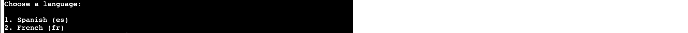
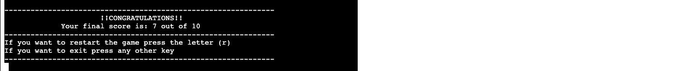
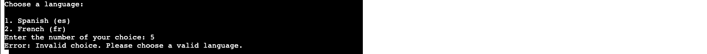

THE LANGUAGE GAME
---

Welcome,

The language game is a pyhton terminal game, which runs in the Code Institute mock terminal on Heroku.

The purpose of this game is learning while playing, the user will chose the language they want to play with
and they will have to translate to english (EN) some random words they will be given.

The game consist in 10 questions and every correct answer the user will earn a point.

Try to complete all 10 questions! 

[Link to The Language Game](https://the-language-game-4bf6dd38ccc8.herokuapp.com/)
---

---

## How to play

- The user enter to the game and they are give the set of instructions 
- Its given a choice to start game (y) 
- The player need to decide in which language you want to try their knowledge:
  - 1. Spanish
  - 2. French
  - 3. Italian
  - 4. German
- This answer needs to be numeric ex: Spanish is number 1.
- After, the player will need to answer 10 questions translating the word that is "shown" into english
- Finally th player will be able to check their scores and will be able to restart the challenge.

- The point of this game is to enjoy, learn and check your basic knowledge in different languages, the words 
provided are easy and usefull words to know and understand.

## Feauters

### Existing Features

- Permanent use of Google Translator API, generating the translator this way
- Random word searcher
- Every question on one game the player will recieve a random question from a list depending on the language
- Also, if the answer is correct the player will have +1 score 
  but if its wrong it will be provided the correct answer to practice.

- Possibility to try knowledge in diferent languages

- Restart game, input vaidation and error checking 

### Future features

- More Laguages to learn
- Dificult choice levels 

## Data Model

### Global Variables:

* answer: input to start or skip the quiz.
* score: A global variable to keep track of the player's score.
* total_questions: The total number of questions in the quiz.
* words: List of words loaded depending on the language.
* word: A randomly chosen word from the list of words.

### Functions:

* search_spanish_words(file_name): Reads words from a file in Spanish.
* search_french_words(file_name): Reads words from a file in French.
* choose_language(): Asks the user to choose a language.
* translate_word(word, src=""): Uses Google Translate to get the translation of a word.
* game_questions(quest_num, word, src=""): Asks the user a question and checks the answer.
* game_loop(): The main loop that iterates through the game questions.
* end_game(): Displays the final score and asks if the player wants to restart or exit.

### Google Translate API:

* translator: An instance of the Google Translate API for translating words.

## Testing

- I have mannually test the full game
- Generating invalid inputs and checking the performance of the game
- Everything works as it should.

- The code was check by a PEP8 linter

| feature | action | expected result | tested | passed | comments |
| --- | --- | --- | --- | --- | --- |
| Start Game | "Y" | You choose yes , the game beggins| Yes | Yes | - |
| Start Game | "N" | You choose no , exiting game | Yes | Yes | - |
| Start Game | another key | Invalid choice. Please enter 'y' or 'n'.| Yes | Yes | - |
| Choose Language | | | | | |
| Spanish | Type 1. | The user starts the game translation from spanish | Yes | Yes | - |
| French| Type 2. | The user starts the game translation from french | Yes | Yes | - |
| Italian | Type 3. | The user starts the game translation from italian | Yes | Yes | - |
| German | Type 4. | The user starts the game translation from german | Yes | Yes | - |
| Another value| Any other number or key| Invalid choice. Please choose a valid language.| Yes | Yes | - |
| Questions | | | | | |
| if correct | right answer | That is correct! Great job! + 1 in score value | Yes | Yes | - |
| if wrong | wrong answer | Wrong answer. The correct answer is "word", score value still the same| Yes | Yes | - |
| End of Game | | | | | |
| Restart Game | "r" | restart the game in the same language| Yes | Yes | - |
| Restart Game | any other key |  Thanks for playing, see you next time. Exiting the game... | Yes | Yes | - |

## Bugs

### Soved bugs

- There where words that appears more than once in each game, I fixed by creating an external list of the same words in where every time a word appears its pop() out if the list so the issue didnt continue.

- After restarting the game the scores continue as the last game, I fixed this by simply start the game loop function checkig the global score that by default was 0.

### Remaining bugs

- No remaining bugs.

### Validator testing

- [PEP8](https://www.pythonchecker.com/)

## Deployment

- This proyect was deployed using Code Institute's mock terminal on Heroku.

- Steps for deployment:

- Following Code Institute tutorials,
    
    * Create a new Heroku app
    * Chose deploment method: Heroku Git, GitHub or Container Registry
    * In this case we used GitHub, so we simply connect it to the gitHub account
    * Link the Heroku app to repository
    * Then go to App connected to GitHub and connect it to your repository using the repository name.
        * Clone: Cloning a repository means making a copy of an existing repository to your local machine.
        * Fork: Forking a repository on GitHub is a way to create a copy of someone else's repository under your GitHub account. This copy is still hosted on GitHub.
    * Set buildbacks to Python and NodeJS in that order
    * Config Vars to PORT 8000
    * Click on Deploy
        * Manual Deploys, you can create an immediate deployment of any branch from the GitHub repo that’s connected to your app. Use manual deploys if you want to control when changes are deployed to Heroku.
        * Automatic Deloys. When you enable automatic deploys for a GitHub branch, Heroku builds and deploys all pushes to that branch.
    
Deploying to Heroku involves taking your code and hosting it on Heroku's platform. This is typically done by pushing your code to a Heroku remote repository.

## Credits

- Python.org for making me understand to accessthe filesystem [os.path](https://docs.python.org/3/library/os.path.html)
-  The python code for explaining how to get the [translator-API](https://thepythoncode.com/article/translate-text-in-python?utm_content=cmp-true)
- Askpython for giving me ideas of games that help me with the first ideas of what I wanted to achieve[like-this-one](https://www.askpython.com/python/examples/easy-games-in-python)
- Educative.io also brought me some creativity wih [this-game](https://www.educative.io/answers/how-to-create-a-word-guessing-game-in-python)
-  Code Insititude for the deployment terminal
[Code Institute](https://codeinstitute.net/) also for my mentor, tutors and community that help me.